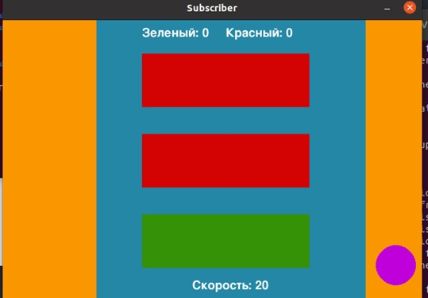
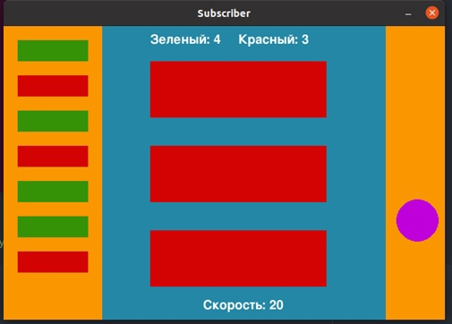

# Пример MQTT

***

## Описание

В проекте показан пример использования MQTT-брокера.

В качестве брокера выбрал сервер Mosquitto MQTT.

MQTT-издателем является Python программа _publisher.py_. Она отправляет рандомные данные на топики _block_ и _speed_, эти данные необходимы, чтобы подписчик MQTT мог задать цвет (красный или зеленый) для трех блоков и скорость движения шарика.

Подписчиком MQTT является Python программа _subscriber.py_. Она получает значения от брокера и по написанной логике задает цвет (красный или зеленый) блокам и скорость шарику, также программ фиксирует количество случаев, когда три блока принимают одинаковый цвет, и отображает этот цвет слева.

Используются:
* Приложения на Python
* Mosquitto

---

## Запуск

В терминале необходимо прописать следующие команды для запуска приложений:


_Терминал 1_
```
>>> docker compose build


>>> docker compose up
```

Далее необходимо создать виртуальное окружение с любым именем (в примере это имя _venv_) в текущей папке и активировать его (пример для Linux):

_Терминал 2_
```
>>> python3 -m venv venv
```

_Терминал 2_
```
>>> source venv/bin/activate

```

Далее устанавливаем все пакеты указанные в _reqs.txt_

_Терминал 2_
```
>>> pip install -r reqs.txt
```

После запускаем файл subscriber.py

_Терминал 2_
```
>>> python3 subscriber.py
```

---

## Результат





